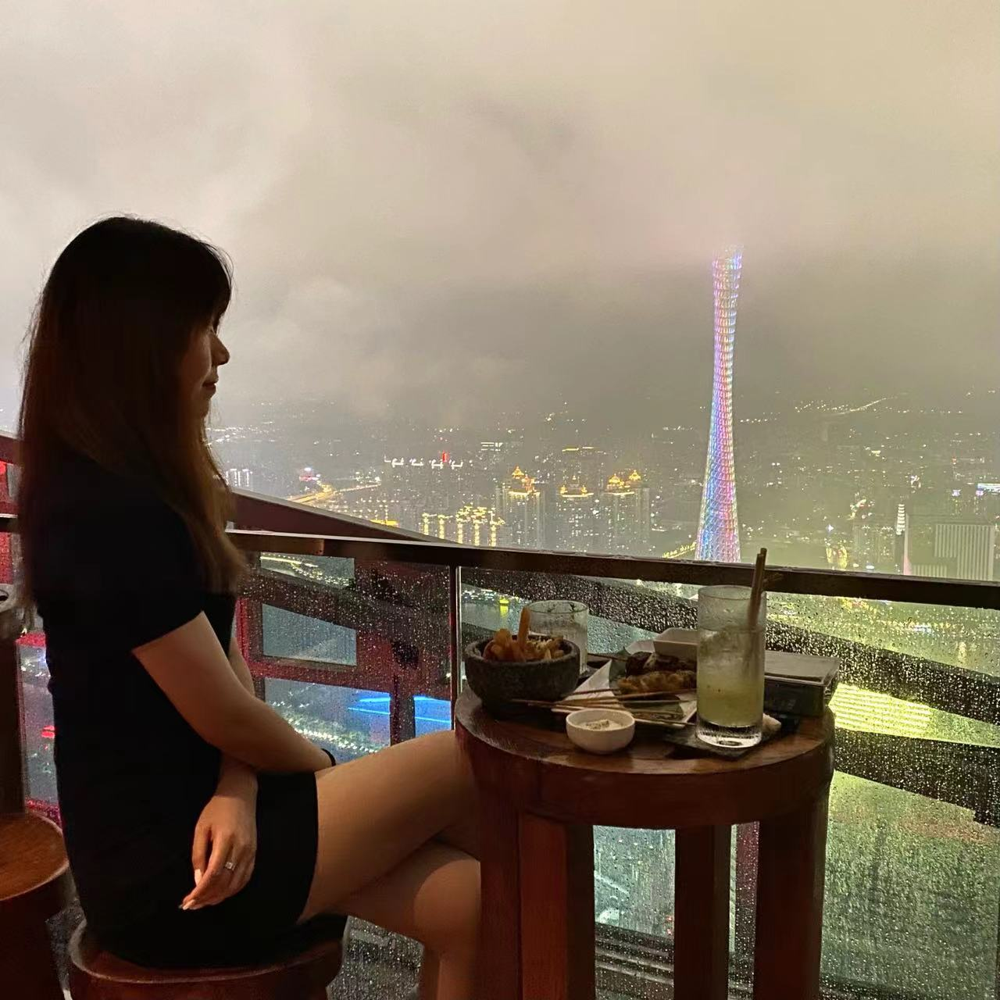
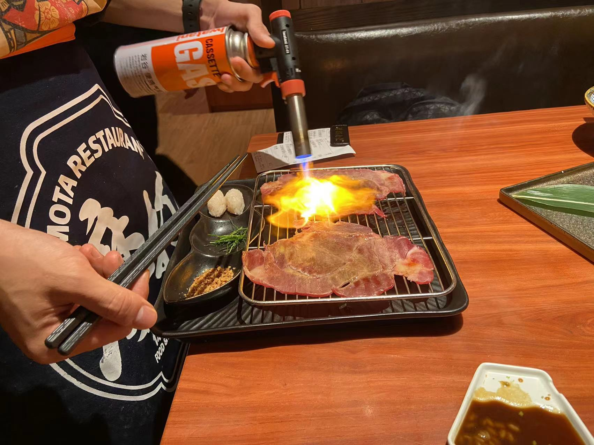
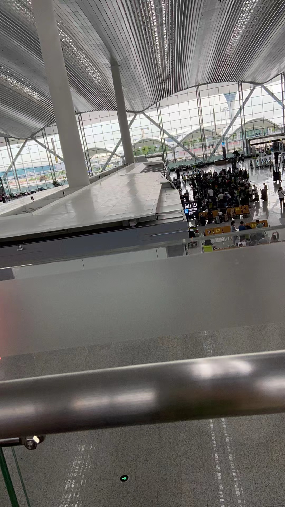
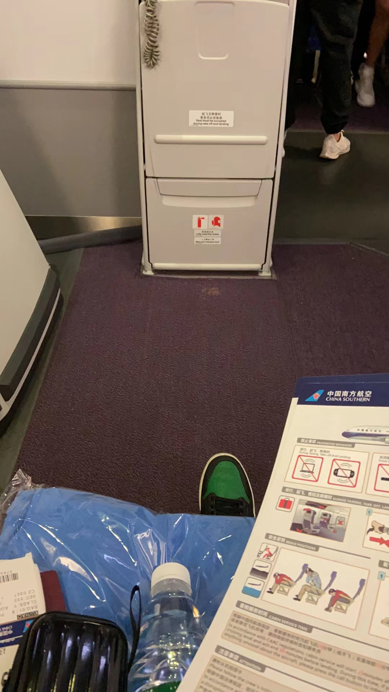

<head>
     <meta charset="UTF-8">
     <title>图片翻转</title>
     <link rel="stylesheet" href="图片翻转.css">
 </head>
 

 

  

   
<h2>老公在W酒店让老婆拍的，没有找到猪，只好用老鼠代替胥哥</h2>

  

 

  

   
<h2>我们在酒吧看广州塔，老婆摆好姿势回头看的时候被老公抓拍到啦</h2>

  

 

  

   
<h2>老公和老婆在广州塔的合照</h2>

  

 

  

   
<h2>老公拍了一张勉强让老婆满意的，可发朋友圈的照片</h2>

  

 

  

   
<h2>摩打食堂，非常可，老公点的太多啦，后面吃的有点恶心心</h2>

  

 

  

   
<h2>老婆在走之前很舍不得老公，跟老公最后的合照</h2>

  

  

 

  

   
<h2>老婆在机场和老公分别了... 老公在楼上等着去托运行李，老公心里空落落的</h2>

  

 

  

   
<h2>老公最后坐上了飞机，将近10个月都见不到老婆了，呜呜</h2>

  

 

 
 
 